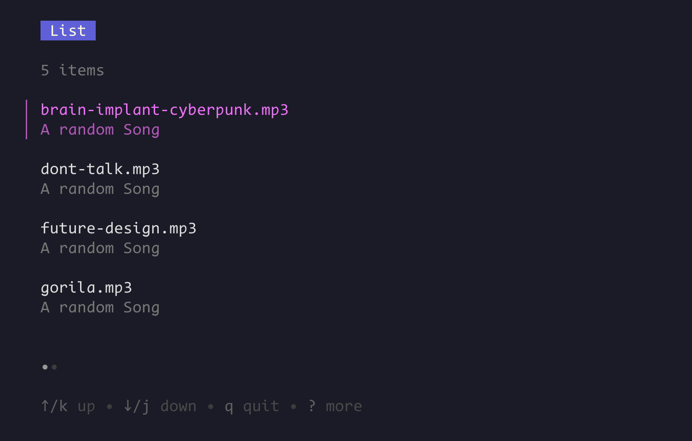

## **GOMP**: Terminal Music Player using Golang


I love to work on terminal. Over the years I've learned to use Neovim, Tmux. Wanted some music when coding, that too inside the terminal with volume control and all local, so... created GOMP. I like to keep my songs locally. (later I'll add an online option.)

**Note**: I just started learning go-multi-threading when I built this. if anyone can suggest something better I'm up for it.


### Installation
#### From the repo
0. Make sure you have go installed and go's bin directory in PATH
1. Clone the repo
```bash
git clone "https://github.com/SoumyaCO/gomp.git
```

2. install
```bash
cd gomp && go install
```
3. check
```bash
cd ~/musics
gomp
```


